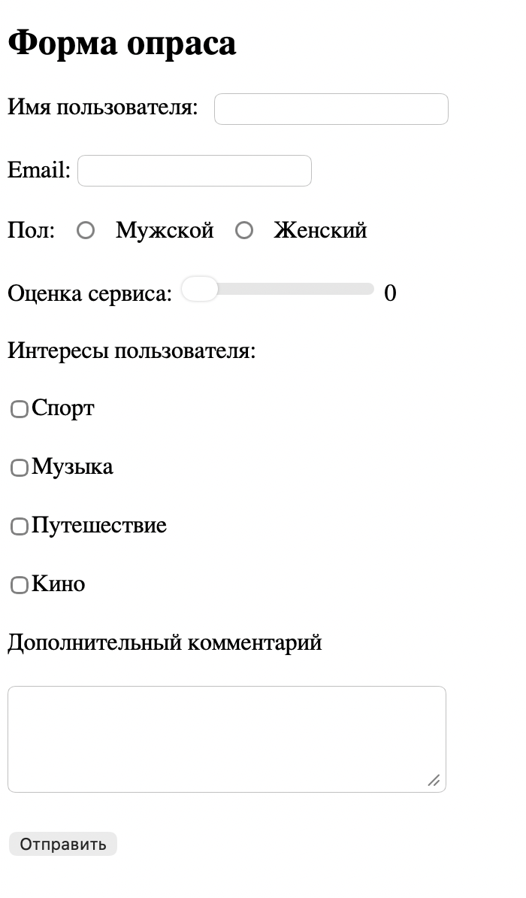

📋 User Survey Form (Интерактивная форма опроса)

Проект интерактивной формы сбора данных о пользователе. Сайт демонстрирует работу с различными типами ввода (input), встроенную валидацию и динамический вывод результатов на страницу без перезагрузки.

🚀 Основные функции:

- Живая валидация: Реализована проверка длины имени пользователя (минимум 3 символа) с выводом предупреждающего сообщения.

- Многофункциональные поля:

- Выбор пола через radio buttons.

- Оценка сервиса с помощью ползунка range.

- Сбор интересов через группу checkbox.

- Мгновенный вывод: После нажатия на кнопку «Отправить» все введенные данные структурировано отображаются под формой.

- Обработка комментариев: Поле textarea для сбора развернутых отзывов.

🛠 Технологии:

- HTML5: Использование семантических тегов форм и различных типов input (email, radio, checkbox, range).

- CSS3: Стилизация элементов формы, создание аккуратного интерфейса и визуальных подсказок для валидации.

- JavaScript (Vanilla JS):

- Сбор значений из всех элементов формы (DOM Manipulation).

- Работа с событиями (click, input).

- Логика объединения выбранных чекбоксов в одну строку для вывода.

📦 Как запустить проект:

- Клонируйте репозиторий на свой Mac.

- Откройте файл index.html в браузере Safari или Chrome.

- Или используйте расширение Live Server в VS Code для мгновенного просмотра.

🔗Ссылка: [https://karinakit.github.io/-User-Survey-Form/]

📎 

💡 Чему я научилась:

- Работать с коллекциями элементов (чекбоксы) и перебирать их для получения значений.

- Настраивать взаимодействие элементов (например, отображение цифры оценки рядом с ползунком).

- Реализовывать базовую логику UX: запрет отправки формы, если данные введены неверно.
